# CUT&RUN Workflow for Slurm

## Overview

This repository contains Slurm templates and helper scripts for CUT&RUN processing, including FASTQ quality control, primary and spike-in alignment, duplicate marking and removal, fragment processing, spike-in-normalized bedGraph generation, and SEACR peak calling. Optional post-processing steps generate bigWig files and heatmaps. Wrapper scripts for `nf-core/cutandrun` are also included.

## Execution Modes

Two execution modes are provided:

- a template-based Slurm workflow via `bin/cutandrun-init` and `bin/cutandrun-submit`
- wrapper scripts for `nf-core/cutandrun` in `nextflow/`

## Workflow Summary

Core processing steps:

1. `01_fastqc.sh`
2. `02_align_primary.sh`
3. `03_align_spikein.sh`
4. `04_mark_duplicates.sh`
5. `05_fragment_lengths.sh`
6. `06_make_fragments_bed.sh`
7. `07_bin_fragments.sh`
8. `08_spikein_normalize.sh`
9. `09_call_peaks_seacr.sh`

Optional post-processing steps:

10. `10_make_bigwig.sh`
11. `11_plot_heatmap.sh`

```mermaid
flowchart LR
  A["Slurm template workflow"] --> S01["01 FastQC"]
  S01 --> S02["02 Primary alignment"]
  S02 --> S03["03 Spike-in alignment"]
  S03 --> S04["04 Mark/remove duplicates"]
  S04 --> S05["05 Fragment lengths"]
  S05 --> S06["06 BAM/BED fragments"]
  S06 --> S07["07 Fragment bins"]
  S07 --> S08["08 Spike-in normalization"]
  S08 --> S09["09 SEACR peak calling"]
  S09 --> S10["10 bigWig generation"]
  S10 --> S11["11 Heatmap generation"]
  B["Alternative execution path"] --> N1["nextflow/run_nfcore_cutandrun.sh"]
  N1 --> N2["nf-core/cutandrun"]
```



## Installation and Requirements

The Slurm workflow requires:

- Bash
- Perl
- a Slurm environment for job submission
- project-specific reference assets and configuration files

End-to-end execution also requires the relevant analysis tools for the chosen path, including `fastqc`, `bowtie2`, `samtools`, `bedtools`, `picard`, `SEACR`, optional `deepTools`, and optionally `nextflow` for the wrapper-based execution path.

## Usage

Minimal Slurm workflow:

```bash
bin/cutandrun-init \
  --project-dir /path/to/project \
  --sample-file examples/slurm-dry-run/samples.txt \
  --experiment demo_run
```

Dry-run the submission chain:

```bash
bin/cutandrun-submit --experiment-dir demo_run --dry-run
```

Optional post-processing can be included at generation time:

```bash
bin/cutandrun-init \
  --project-dir /path/to/project \
  --sample-file examples/slurm-dry-run/samples.txt \
  --experiment demo_run \
  --include-postprocess
```

For the wrapper-based alternative:

```bash
bash nextflow/run_nfcore_cutandrun.sh config/nextflow.env
```

Additional usage notes are provided in:

- `docs/quickstart.md`
- `docs/inputs.md`
- `docs/outputs.md`
- `docs/reproducibility.md`

## Inputs, Outputs, and Reproducibility

Project-specific reference assets, control assignments, and tool paths are supplied through configuration files. Input requirements, output locations, and reproducibility notes are documented in:

- `docs/inputs.md`
- `docs/outputs.md`
- `docs/reproducibility.md`

## Local Validation

Smoke-test assets are provided in `tests/smoke/`. On May 19, 2026, the local smoke test rendered a demo experiment bundle from the example sample manifest and dry-ran the full `01` to `11` submission chain on macOS. This validates workflow generation and submission ordering, but not end-to-end biological execution.

## Repository Layout

- `bin/`: user-facing command entrypoints
- `templates/slurm/`: core Slurm workflow templates
- `templates/postprocess/`: optional post-processing templates
- `scripts/`: implementation scripts used by the `bin/` wrappers
- `config/`: example configuration files
- `nextflow/`: `nf-core/cutandrun` wrappers
- `examples/`: minimal example inputs
- `tests/smoke/`: local smoke-test assets
- `docs/`: workflow documentation

## References

- Meers MP, Tenenbaum D, Henikoff S. [Improved CUT&RUN chromatin profiling tools](https://elifesciences.org/articles/46314)
- [nf-core/cutandrun](https://github.com/nf-core/cutandrun)
