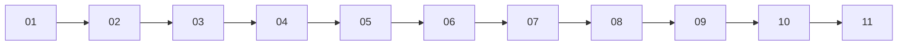

# Validation Notes

## Local Result

On May 19, 2026, the local smoke-test entrypoint `tests/smoke/run_slurm_smoke.sh` was run successfully on macOS.

Verified locally:

- `bash -n bin/cutandrun-init`
- `bash -n bin/cutandrun-submit`
- `perl -c scripts/generate_experiment.pl`
- `perl -c scripts/submit_chain.pl`
- `bash -n templates/slurm/common.sh`
- `bash -n templates/slurm/*.sh`
- `bash -n templates/postprocess/*.sh`
- `bash -n nextflow/*.sh`
- generation of a demo experiment bundle from the example sample manifest
- dry-run rendering of the full `01` to `11` Slurm dependency chain

Interpretation:

- this is a workflow-integrity validation of script generation and submission order
- this is not an end-to-end biological validation or a benchmark on sequencing data

## Local Tool Availability

Available locally during this validation:

- `perl`
- `Rscript`
- `python3`
- `samtools`

Not available locally during this validation:

- `fastqc`
- `bowtie2`
- `bedtools`
- `picard`
- `nextflow`
- `SEACR`
- `deepTools`

## Not Executed

The workflow was not run end-to-end because that would require:

- real FASTQ inputs
- pinned reference indexes and chromosome sizes
- a Slurm environment
- the full analysis toolchain listed above
